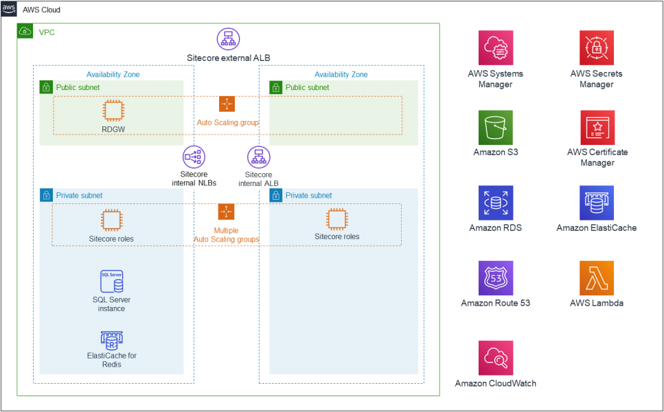
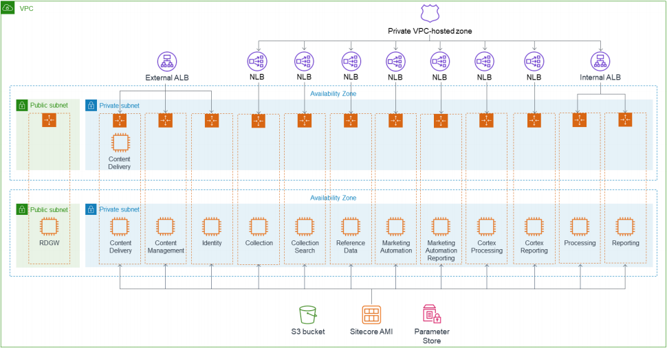

Deploying this Quick Start for a new virtual private cloud (VPC) with
*default parameters* builds the following _{partner-product-name}_ environment in the
AWS Cloud.

// Replace this example diagram with your own. Send us your source PowerPoint file. Be sure to follow our guidelines here : http://(we should include these points on our contributors giude)
[#architecture1]
.Quick Start architecture for _{partner-product-name}_ on AWS
[link=images/architecture_diagram.png]

[#architecture2]
.Quick Start architecture of resources for _{partner-product-name}_ on AWS
[link=images/architecture_diagram_2.png]

As shown in figures 1 and 2, the Quick Start sets up the following:

* A highly available architecture that spans two Availability Zones.*
* A virtual private cloud (VPC) configured with public and private subnets, according to
AWS best practices, to provide you with your own virtual network on AWS.*
* A Microsoft remote desktop gateway (RDGW) in an Auto Scaling group to allow
inbound remote desktop access to Amazon Elastic Compute Cloud (Amazon EC2)
instances in the public and private subnets.*
* In the public subnets:
** Managed network address translation (NAT) gateways to allow outbound
internet access for resources in the private subnets.*
** An internet-facing Application Load Balancer (ALB) for routing traffic to the
instances for content delivery, content management, and identity server.
* In the private subnets:
** Sitecore roles deployed on a single Amazon EC2 instance that’s contained within
an Auto Scaling group.
** An internal ALB for the reporting and processing roles.
** Network Load Balancers (NLBs) for Transport Layer Security (TLS) pass-through
for the remaining Sitecore instances.
** Each EC2 instance is deployed into its own Auto Scaling group.
** Amazon Route 53 private hosted zone for internal Domain Name System (DNS)
lookups within the VPC.
** Amazon ElastiCache for Redis.
* An EC2 Amazon Machine Image (AMI), which is used in the initial deployment of all
Sitecore roles and in subsequent Auto Scaling events.
* AWS Systems Manager to store parameter data and the AMI automation build
document.
* Amazon Simple Storage Service (Amazon S3) artifacts bucket for storing static data.
* Amazon RDS SQL Server to provide database services.
* Amazon CloudWatch for monitoring deployed services.
* AWS Secrets Manager for access control.
* AWS Certificate Manager (ACM) for access control.
* A Lambda function to convert and import the certificate into ACM

*The template that deploys the Quick Start into an existing VPC skips
the components marked by asterisks and prompts you for your existing VPC
configuration.